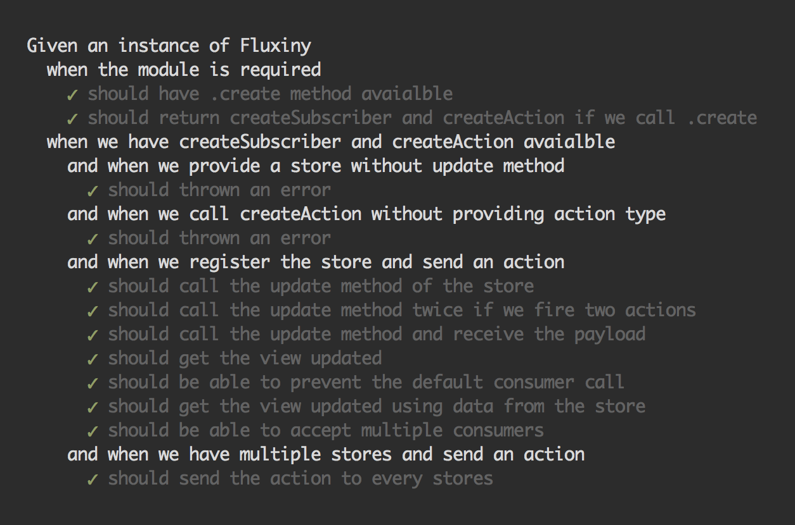

# Fluxiny

> [Flux architecture](https://facebook.github.io/flux/docs/overview.html) implemented in ~100 lines of code.


## Usage

Fluxiny has an API of only two methods - `createSubscriber` and `createAction`.

```
import Fluxiny from 'fluxiny';

const { createSubscriber, createAction } = Fluxiny.create();
```

#### Registering a store into the dispatcher

The only one requirements to the store is the existence of an `update` method.

```js
var Store = { 
  update: function (action, change) { 
    // ...
  }
};
var subscriber = createSubscriber(Store);
```

#### Mutating the state of the store and notifying the view

The `update` method of the store accepts two arguments. An `action` with signature `{ type, payload }` and a function `change`. The store updates its internal state based on `action.type` and then fires `change()` notifying the view for that change.

```js
var Store = { 
  _data: { value: 0 },
  update: function (action, change) { 
    if (action.type === 'increase') {
      this._data.value += action.payload;
      change();
    }
  }
};
```

#### Subscribing the view to changes in the store

Remember how `createSubscriber` returns a `subscriber` variable. That's actually a function. It accepts a callback which is fired every time when the store calls `change()` internally.

```js
var Store = { 
  _data: { value: 0 },
  update: function (action, change) { 
    // updates _data.value
    change();
  },
  getValue: function () {
    return this._data.value;
  }
};
var storeSubscriber = createSubscriber(Store);

var View = function (subscriber) {
  var counterValue;
  var consumer = store => {
    counterValue = store.getValue();
    // calling render()
  }

  subscriber(consumer);
};

View(storeSubscriber);

```
Notice how we need a getter in the store so the view could fetch the needed information. In Fluxiny the view says what it needs from the store and not the store pushes data to the view.

*Note that the `consumer` function is called at least once by default.*

#### Dispatching an action

Fluxiny uses the action-creator pattern. We specify the type of the action and as a result we get a function. For example:

```js
var increaseAction = createAction('increase');

var View = function (subscriber, increaseAction) {
  // ...
  increaseButton.addEventListener('click', increaseAction);
};

View(subscriber, increaseAction);
```

In the example above all the stores will receive an action with `type` equal to `increase` and `payload` equal to mouse event object. Or in other words what we pass to `increaseAction` is attached to `payload` property of the action. In this particular example the browser sends an event object.

## Setup

As a script tag directly in the browser:

```html
<script src="fluxiny.min.js"></script>
<script>
  var Flux = Fluxiny.create();
  // Flux.createSubscriber
  // Flux.createAction
</script>
```

Via npm:

```
npm install fluxiny
```

Then simply import the module with

```js
// var Fluxiny = require('fluxiny');
import Fluxiny from 'fluxiny';
```

## Testing

Run the following command:

```
npm install && npm run test
```



## Resources

* [Dissection of Flux architecture or how to write your own](http://krasimirtsonev.com/blog/article/dissection-of-flux-architecture-or-how-to-write-your-own-react)
* Simple live demo of Fluxiny - [jsfiddle.net/krasimir/w0ne11bh](https://jsfiddle.net/krasimir/w0ne11bh/)
* Live demo using React - [krasimir.github.io/fluxiny/example/](http://krasimir.github.io/fluxiny/example/) and source code [here](https://github.com/krasimir/fluxiny/tree/master/example).