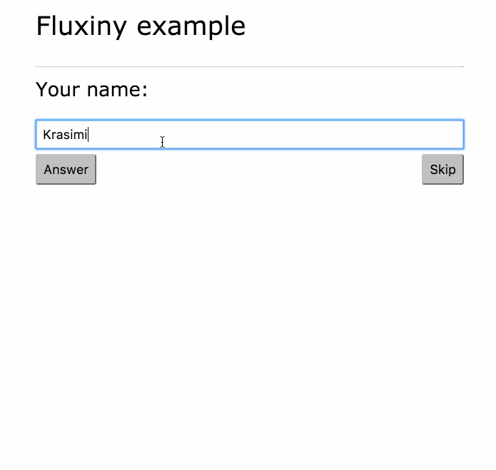

# A survey application based on Fluxiny and React

The example here uses Fluxiny as a flux architecture helper. It's an application that fetches quesitons from external JSON files and displays them. It also collects the answers of the questions.

## The example demonstrates

* Flux architecture
* Managing Ajax requests
* Managing Errors
* Keeping data

## Preview

## Misc

* Questions from [JavaScript Developer Survey Results](https://ponyfoo.com/articles/javascript-developer-survey-results)